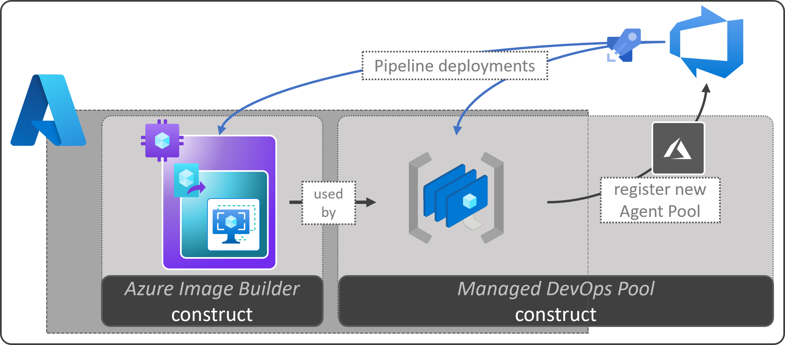

# DevOps Self-Hosted Constructs Repository

## Description

This repository provides you with several constructs (i.e. templates & pipelines) to deploy solutions around self-hosted agents for DevOps environments.

In some instances you can combine the constructs to, for example, build an image for self-hosted Azure DevOps scale set agents. Furthermore, constructs may be based on the [CARML](https://aka.ms/CARML) library to simplify deployments.

Currently the repository contains the following constructs:

| Construct | Description | Path |
| - | - | - |
| Azure Image Builder | This construct provides a packages solution to create custom images using the Azure Image Builder service with an Azure Compute Gallery, including guidelines to operate it. | [`constructs\azureImageBuilder`](https://github.com/Azure/DevOps-Self-Hosted/tree/main/constructs/azureImageBuilder) |
| Azure DevOps Scale Set | This construct provides a packaged solution to deploy the infrastructure for self-hosted Azure DevOps scale sets, including guidelines to maintain it. | [`constructs\azureDevOpsScaleSet`](https://github.com/Azure/DevOps-Self-Hosted/tree/main/constructs/azureDevOpsScaleSet) |

For detailed information on the constructs and how to get started, please continue to the [Wiki](https://github.com/Azure/DevOps-Self-Hosted/wiki).

## Contributing

This project welcomes contributions and suggestions.  Most contributions require you to agree to a
Contributor License Agreement (CLA) declaring that you have the right to, and actually do, grant us
the rights to use your contribution. For details, visit https://cla.opensource.microsoft.com.

When you submit a pull request, a CLA bot will automatically determine whether you need to provide
a CLA and decorate the PR appropriately (e.g., status check, comment). Simply follow the instructions
provided by the bot. You will only need to do this once across all repos using our CLA.

This project has adopted the [Microsoft Open Source Code of Conduct](https://opensource.microsoft.com/codeofconduct/).
For more information see the [Code of Conduct FAQ](https://opensource.microsoft.com/codeofconduct/faq/) or
contact [opencode@microsoft.com](mailto:opencode@microsoft.com) with any additional questions or comments.

## Trademarks

This project may contain trademarks or logos for projects, products, or services. Authorized use of Microsoft
trademarks or logos is subject to and must follow
[Microsoft's Trademark & Brand Guidelines](https://www.microsoft.com/en-us/legal/intellectualproperty/trademarks/usage/general).
Use of Microsoft trademarks or logos in modified versions of this project must not cause confusion or imply Microsoft sponsorship.
Any use of third-party trademarks or logos are subject to those third-party's policies.
