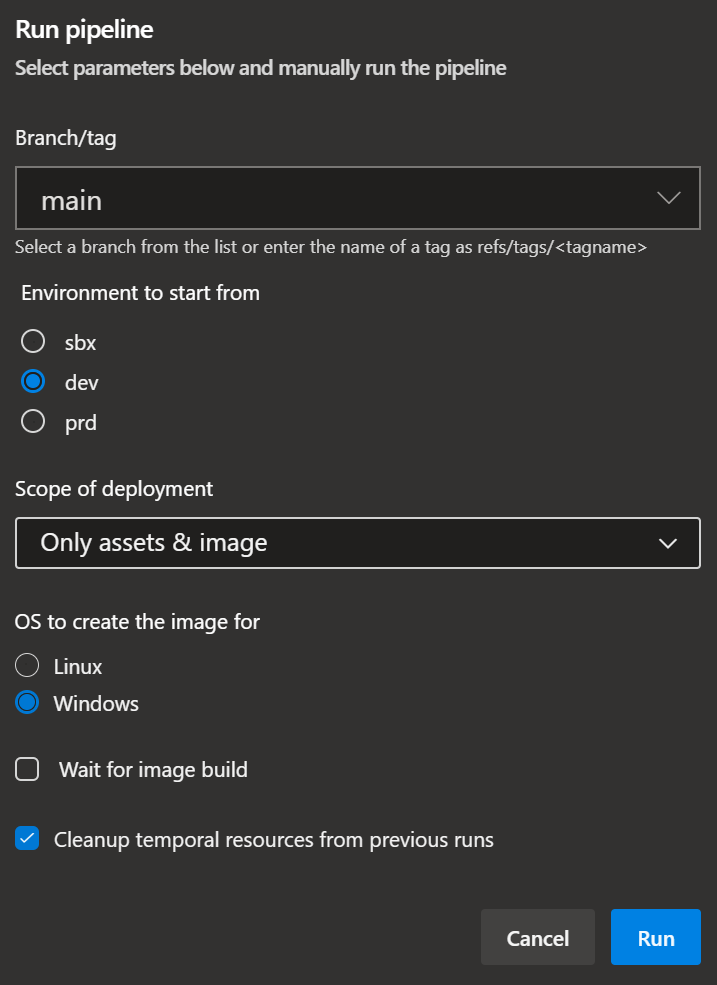

This sections gives you an overview on how to use the Azure Image Builder (AIB) pipeline to deploy the required infrastructure for, and build images with the Azure Image Builder.

### _Navigation_
- [Overview](#overview)
  - [Prerequisites](#prerequisites)
  - [Elements](#elements)
  - [File structure & flow](#file-structure--flow)
- [Process](#process)
  - [Initial configuration](#initial-configuration)
  - [Deployment](#deployment)
    - [First deployment](#first-deployment)
    - [Consecutive deployments](#consecutive-deployments)
- [Out of the box installed components](#out-of-the-box-installed-components)
- [Troubleshooting](#troubleshooting)

# Overview

## Prerequisites

The deployments described in the following sections assume certain prerequisites to be in place prior to deployment.

- The deployment principal (e.g., the Service Principal tied to the deploying Service Connection) must have at least `Contributor` & `User Access Adminitrator` permissions on the target subscription to be able to deploy both resources and assign permissions to created user-assigned identities
- IF you have a policy in place that prevents Storage Accounts from being deployed without a Firewall, you have to create an exemption for the Image Template / Staging Resource Group you can configure for the Image Template Resource (parameter `imageTemplateResourceGroupName`). The rationale is that the Azure-Image-Builder service uses this resource group to deploy both temporal resources used during the image build (e.g., a Virtual Machine), as well as a Storage Account to store temporal files & a 'packerlogs/customization.log' file in (which contains the logs of the image build). This Storage Account has no firewall configured, has a random name, and cannot be configured at deploy time.

## Elements
The image creation uses several components:

| &nbsp;&nbsp;&nbsp; | Resource | Description |
|--|--|--|
|  | Resource Group | The resource group hosting the image resources |
|  | (Image) Resource Group | The resource group hosting the resources created during the image build |
|  | (Assets) Storage Account | The storage account that hosts the image customization scripts used by the _Azure Image Building_ when executing the image template. |
|  | (DS) Storage Account | The storage account that hosts the files of the Deployment Scripts. Required for private networking. |
|  | (Image) User-Assigned Managed Identity | Azure Active Directory feature that eliminates the need for credentials in code, rotates credentials automatically, and reduces identity maintenance. In the context of the imaging construct, the managed identity (MSI) is used by the Image Builder Service. It is assigned contributor permissions on the subscription to be able to bake the image. Further, it is assigned read permissions on the Assets Storage Account Container in order to consume the customization scripts. |
|  | (DS) User-Assigned Managed Identity | Azure Active Directory feature that eliminates the need for credentials in code, rotates credentials automatically, and reduces identity maintenance. In the context of the imaging construct, the managed identity (MSI) is used by the Image Builder Service. It's assigned permissions on the Image Template to trigger it, the Deployment Script Storage Account for Private Networking, and the Assets Storage Account to upload files.  |
|  | (Storage) Deployment Script | The Deployment Script that uploads the customization scripts to the Assets Storage Account. |
|  | (Trigger) Deployment Script | The Deployment Script that triggers the Image Template build. |
|  | Azure Compute Gallery | Azure service that helps to build structure and organization for managed images. Provides global replication, versioning, grouping, sharing across subscriptions and scaling. The plain resource in itself is like an empty container. |
|  | Azure Compute Gallery Image | Created within a gallery and contains information about the image and requirements for using it internally. This includes metadata like whether the image is Windows or Linux, release notes and recommended compute resources. Like the image gallery itself it acts like a container for the actual images. |
|  | Image Template | A standard Azure Image Builder template that defines the parameters for building a custom image with AIB. The parameters include image source (Marketplace, custom image, etc.), customization options (i.e., Updates, scripts, restarts), and distribution (i.e., managed image, Azure Compute Gallery). The template is not an actual resource. Instead, when an image template is created, Azure stores all the metadata of the referenced Azure Compute Gallery Image alongside other image backing instructions as a hidden resource in a temporary resource group. |
|  | Image Version | An image version (for example `0.24322.55884`) is what you use to create a VM when using a gallery. You can have multiple versions of an image as needed for your environment. This value **cannot** be chosen. |

<p>


<p>

> _**NOTE:**_ The construct was build with multiple environments and staging in mind. To this end, pipeline variable files contain one variable per suggested environment (for example `vmImage_sbx` & `vmImage_dev`) which is automatically referenced by the corresponding stage. For details on how to work with and configure these variables, please refer to this [section](./Staging).
>
> For the rest of the documentation we will ignore these environments and just refer to the simple variable or parameter file to avoid confusion around which file we refer to. All concepts apply to all files, no matter the environment/stage.

## File structure & flow

This section gives you an overview of the solution's structure, that is, how its files are linked to each other.

- **Pipeline Stage template:** This is the entry point for the solution. It's the pipeline template you register in Azure DevOps to trigger a deployment. It contains one stage per environment you'd want to deploy to.
- **Pipeline Jobs template:** This template contains the actual steps of your pipeline, that is tasks that run PowerShell scripts, and or deploy Bicep templates to Azure.
- **PowerShell scripts:** These scripts execute deployment-unrelated actions that, for example, setup your Azure environment / remove leftover artifacts.
- **Bicep Deployment files:** The Bicep template file that contains the custom parameter you want to set per environment. By default, it only contains a subset of parameters, but can be expanded upon additional parameters available in the _Bicep template file_.
- **Bicep template file:** The Bicep file template file that contains the blueprint / orchestration of the infrastructure you want to deploy into an environment. It has parameters for all relevant infrastructure properties, but can be extended with any additional parameter available in the contained resource (/ module) deployments. It also contains a reference to the script files to upload to the _Assets Storage Account_.
- **Bicep AVM modules:** The resource modules imported from the [Azure-Verified-Modules](https://aka.ms/avm) library that contain most of the actual resource deployment logic.

<p>


<p>

> **Note:** All files are written in a way that should make modifications easy. However, to help you get started, please take not of the following recommendations:
> - If you want to add additional logic to your pipeline, make sure to modify the `pipeline.jobs.yml` template to ensure that the added / modified steps are applied equally across all stages.
> - If you want to add additional resources to your deployment, make sure to modify the `image.deploy.bicep` file to ensure that the added / modified resources are applied to all environments equally. If you further want to ensure your template remains flexible, you can add additional parameters you can then reference from the `<env>.image.bicep` file.
> - If you want to modify any of the existing module templates and discover a property you want to use is missing, you can simply add it to the corresponding module. However, to use it, make sure to not only add a parameter for your new property to the module, but also give it a value by providing it in the ` image.deploy.bicep` file.

# Process

This section explains how to deploy the image pipeline construct and use it on a continuous basis.

## Initial configuration

To prepare the construct for usage you have to perform two fundamental steps:

<details>
<summary>1. Configure the deployment parameters</summary>

For this step you have to update these files to your needs:
- `.azuredevops\azureImageBuilder\variables.yml`
- `constructs\azureImageBuilder\deploymentFiles\<env>.image.bicep`

### Variables
The first file, `variables.yml`, is a pipeline variable file. You should update at least the values:
- `vmImage`: Set this to for example `ubuntu-latest` to leverage Microsoft-hosted agents. Leave it empty (`''`) if you use self-hosted agents. Do not remove it.
- `poolName`: Set this to for example `myHostPool` to leverage your self-hosted agent pool. Leave it empty (`''`) if you use Microsoft-hosted agents. Do not remove it.
- `serviceConnection`: This refers to your Azure DevOps service connection you use for your deployments. It should point into the subscription you want to deploy into.
- `location`: The location to store deployment metadata in. This variable is also used as a default location to deploy into, if no location is provided in the parameter files.

### Parameters
Next, we have one deployment file, `<env>.image.bicep` that hosts to the two phases in the deployment: Deploy all infrastructure components & build the image.

The file comes with out-of-the box parameters that you can use aside from a few noteworthy exceptions:
- Update any name of a resource that is deployed and must be globally unique (for example storage accounts).

> **Note:** To keep the parameter files as simple as possible, all values that don't necessarily need you attention are hardcoded as default values in the corresponding template files. To get an overview about these 'defaults', you can simply navigate from the parameter file to the linked template.

The parameter files are created with a Linux-Image in mind. However, they also contain examples on how the same implementation would look like for Windows images. Examples are always commented and can be used to replace the currently not commented values.

As the deployments leverage [`AVM`](https://aka.ms/avm) modules you can find a full list of all supported parameters per module in that repository's modules. A valid example may be that you want to deploy the Image Template into a specific subnet for networking access. This and several other parameters are available and documented in the module's `readme.md`.

#### Special case: **Image Template**

The image template ultimately decides what happens during the image built. In this construct, it works in combination with the scripts provided in the `constructs\azureImageBuilder\scripts\uploads` folder.

When you eventually trigger the pipeline, it will upload any script in the `uploads` folder to a dedicated storage account for the image building process using a deployment script and then execute it as per the configured steps in the Image Template's parameter file's `customizationSteps` parameter. For Linux we use for example the following two steps:

```Bicep
imageTemplateCustomizationSteps: [
  {
      type: 'Shell'
      name: 'PowerShell installation'
      scriptUri: 'https://<assetsStorageAccountName>.blob.core.windows.net/aibscripts/Install-LinuxPowerShell.sh'
  }
  {
      type: 'Shell'
      name: 'Prepare software installation'
      inline: [
          'wget \'https://<assetsStorageAccountName>.blob.core.windows.net/aibscripts/Initialize-LinuxSoftware.ps1\' -O \'Initialize-LinuxSoftware.ps1\''
          'sed -i \'s/\r$//' 'Initialize-LinuxSoftware.ps1\''
          'pwsh \'Initialize-LinuxSoftware.ps1\''
      ]
  }
]
```

By default, it first installs PowerShell on the target machine and then continues by executing the installation script. Feel free to modify the existing script, or add new ones with new customization steps as you see fit. You can find a full list of all available steps [here](https://docs.microsoft.com/en-us/azure/virtual-machines/linux/image-builder-json#properties-customize).

</details>

<details>
<summary>2. Register the pipeline</summary>

With the parameters configured, you can now continue and register the pipeline in Azure DevOps.

To do so, you have to perform the following steps:

1. Navigate to the Azure DevOps project you want to register the pipeline in
1. Select `Pipelines` to the left and further its `Pipelines` sub-section

   

1. Now select `New pipeline` on the top right

   

1. Next, select the location of you pipeline file. If you host the repository in GitHub, select `GitHub`, or for example `Azure Repos Git` if you host the code in Azure DevOps's own git.

1. In the opening `Select` step, select your repository

1. In the opening `Configure` step, select `Existing Azure Ppelines YAML`

1. In the opening blade, select the `Branch` your code is in, and in `Path` the pipeline's path. Once done, select `Continue` on the bottom right

1. In the opening `Review` step, you can now see the pipeline you select and can either select `Run` or (via the dropdown) `Save` on the top right.

1. Optionally, once saved, you can rename & move the pipeline by selecting the three '`...`' on the top right, and select `Rename/move`

   

</details>

## Deployment

The creation of the image alongside its resources is handled by the `.azuredevops\azureImageBuilder\pipeline.yml` pipeline. Given the proper configuration, it creates all required resources in the designated environment and optionally triggers the image creation right after.

  

So let's take a look at the different configuration options when running the pipeline:

| Runtime Parameter | Description | On first deployment | Additional notes |
| - | - | - | - |
| `Environment to start from` | The environment you want to start to deploy into as described [here](./Staging#3-run-the-pipeline)  | Set to `SBX` | |
| `Scope of deployment` | Select whether you want to deploy all resources, all resources without triggering the image build, or only the image build | Set to deploy `All` or `Only base` resources | Overall you have the following options: <p> <li>**`All`**: Deploys all resources end-to-end including an image build</li><li>**`Only removal`**: Only removes previous image templates (and their AIB resource groups) that match the provided Image Template name and are not in state `running`. Further, terminated deployment scripts who's name starts with the `defaultPrefix` specified in the `<env>.image.bicep` file are removed. Is only executed if the `Pre-remove Image Template Resource Group` checkbox is selected too.</li><li>**`Only base`**: Deploys everything, but the image template. As such, no image is built</li><li>**`Only assets & image`**: Only uploads the latest installation files from the `uploads` folder and trigger an image build</li><li>**`Only image`**: Only trigger an image build</li> |
| `Wait for image build` |  Specify whether to wait for the image build process during the pipeline run or not. The process itself is triggered asynchronously. | De-Select |  You can use the 'Wait-ForImageBuild' script to check the status yourself (located at: `constructs\azureImageBuilder\scripts\image\Wait-ForImageBuild.ps1`). <p> To execute it you will need the image template name (output value of the image template deployment) and the resource group the image template was deployed into. Is only considered, if the `Scope of the deployment` includes an image build. |
| `Pre-remove Image Template Resource Group` | Specify whether to remove previous image resources. This includes all Image Templates that match the naming schema defined in the parameter file - as long es their built is not in state `running`.  | De-select | |

### First deployment
When triggering the pipeline for the first time for any environment, make sure you either select `All` or `Only base` for the `Scope of the deployment`. In either case the pipeline will deploy all resources and scripts you will subsequently need to create the images. For any subsequent run, you can go with any option you need.

The steps the _Azure Image Builder_ performs on the image are defined by elements configured in the `customizationSteps` parameter of the image template parameter file. In our setup we reference one or multiple custom scripts that are uploaded by the template to a storage account ahead of the image deployment.
The scripts are different for the type of OS and hence are also stored in two different folders in the `PipelineAgentsScaleSet` module:

- Linux:    `constructs\azureImageBuilder\scripts\uploads\linux\Initialize-LinuxSoftware.ps1`
- Windows:  `constructs\azureImageBuilder\scripts\uploads\windows\Initialize-WindowsSoftware.ps1`

One of the main tasks performed by these scripts are the installation of the baseline modules and software we want to have installed on the image. Prime candidates are for example the Az PowerShell modules, Bicep or Terraform.

### Consecutive deployments

After you built your first image, there are a few things to be aware of to operate the pipeline efficiently:

<details>
<summary>Regular cleanup</summary>

You can use the pipeline's checkbox `Pre-remove Image Template Resource Group` at any point with the scope set to `Only removal` to clean your environment up (i.e. remove leftover Image-Templates and AIB resource groups).

</details>

<details>
<summary>Default scope</summary>

Usually, when you will operate the pipeline you would want to either run in scope `Only assets & image` or `Only image`. The first is interesting in case you modified your customization steps and hence want to roll them out. However, if you just want to update your image (for example have it install the latest Bicep version), `Only image` would already be sufficient.

</details>

<details>
<summary>Stacked images</summary>

  Any time you run an image built you first have to decide whether you want to build an image from the ground up (using e.g. a marketplace image as the basis) or build on an existing custom image. In either case you have to configure the image template parameter file in question with regards to the `imageSource` parameter.
  To reference a marketplace image use the syntax:
  ```Bicep
  {
    imageSource: {
      type: 'PlatformImage'
      publisher: 'MicrosoftWindowsDesktop'
      offer: 'Windows-10'
      sku: '19h2-evd'
      version: 'latest'
    }
  }
  ```
  To reference a custom image use the syntax (where the ID is the resourceId of the image version in the Azure Compute Gallery):
  ```Bicep
  {
    imageSource: {
      type: 'SharedImageVersion'
      imageVersionID: '/subscriptions/c64d2kd9-4679-45f5-b17a-e27b0214acp4d/resourceGroups/rg-scaleset/providers/Microsoft.Compute/galleries/galmy/images/mydefinition/versions/0.24457.34028'
    }
  }
  ```
</details>

# Out of the box installed components

Following you can find an overview of the installed elements currently implemented in the scripts of the `constructs\azureImageBuilder\scripts\uploads` folder:

| OS |   |   | Windows | Linux |
| -  | - | - | -       | -     |
| Software | `Choco` | | :heavy_check_mark: | |
| | `Azure-CLI` | | :heavy_check_mark: | :heavy_check_mark: |
| | `Bicep-CLI` | | :heavy_check_mark: | :heavy_check_mark: |
| | `PowerShell Core (7.*)` | | :heavy_check_mark: | :heavy_check_mark: |
| | `.NET SDK` | | | :heavy_check_mark: |
| | `.NET Runtime` | | | :heavy_check_mark: |
| | `Nuget Package Provider` | | :heavy_check_mark: | :heavy_check_mark: (`dotnet nuget`) |
| | `Terraform` | | :heavy_check_mark: (`latest`) | :heavy_check_mark: (`0.12.30`)  |
| | `azcopy` | |  :heavy_check_mark: (`latest`) |  :heavy_check_mark: (`latest`) |
| | `docker` | |  :heavy_check_mark: (`latest`) |  :heavy_check_mark: (`latest`) |
| | | | | |
| Modules
| | PowerShell
| | | `PowerShellGet` | :heavy_check_mark: | :heavy_check_mark: |
| | | `Pester` | :heavy_check_mark: | :heavy_check_mark: |
| | | `PSScriptAnalyzer` | :heavy_check_mark: | :heavy_check_mark: |
| | | `powershell-yaml` | :heavy_check_mark: | :heavy_check_mark: |
| | | `Azure.*` | :heavy_check_mark: | :heavy_check_mark: |
| | | `Logging` | :heavy_check_mark: | :heavy_check_mark: |
| | | `PoshRSJob` | :heavy_check_mark: | :heavy_check_mark: |
| | | `ThreadJob` | :heavy_check_mark: | :heavy_check_mark: |
| | | `JWTDetails` | :heavy_check_mark: | :heavy_check_mark: |
| | | `OMSIngestionAPI` | :heavy_check_mark: | :heavy_check_mark: |
| | | `Az` | :heavy_check_mark: | :heavy_check_mark: |
| | | `AzureAD` | :heavy_check_mark: | :heavy_check_mark: |
| | | `ImportExcel` | :heavy_check_mark: | :heavy_check_mark: |
| Extensions
| | CLI
| | | `kubenet` | :heavy_check_mark: | :heavy_check_mark: |
| | | `azure-devops` | :heavy_check_mark: | :heavy_check_mark: |
</details>


# Troubleshooting

Most commonly issues with the construct occur during the image building process due to script errors. As those are hard to troubleshoot and the AIB VMs that are used to bake images are not accessible, the AIB service writes logs into a storage account in the 'staging' resource group it generates during the building process as documented [here](https://docs.microsoft.com/en-us/azure/virtual-machines/linux/image-builder-troubleshoot#customization-log).

Aside from the packer logs, it will also contain the logs generated by the provided customization scripts and hence provide you insights into 'where' something wrong, and ideally also 'what' went wrong.
