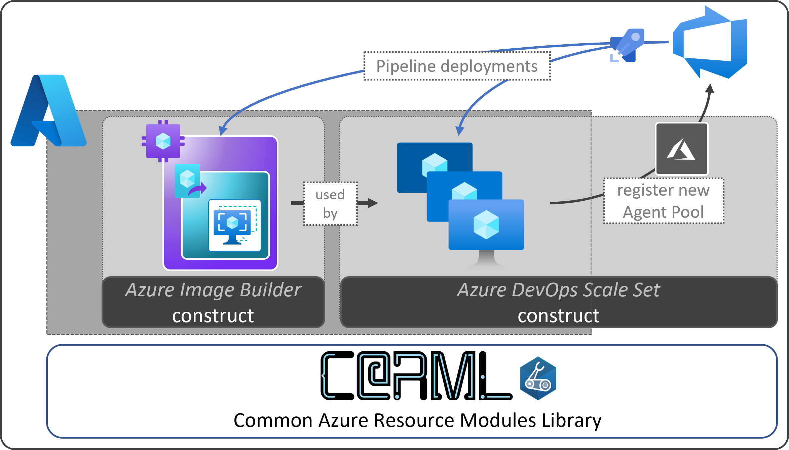

# Self-Hosted Agents

The objective of this repository is to provide you with example implementations for self-hosted DevOps agents. This includes a pipeline to bake images via the Azure Image Builder solution.

### _Navigation_

Core
- [Creating images with the Azure Image Builder](./Creating%20images%20with%20the%20Azure%20Image%20Builder)
- [Self-hosted Azure DevOps Virtual Machine Scale Set Agents](./Self-hosted%20Azure%20DevOps%20Virtual%20Machine%20Scale%20Set%20Agents)

Shared concepts
- [Staging](./Staging)

### Additional resources

Telemetry

Each leveraged CARML module (see corresponding folder in root) contains a `defaultTelemetry` deployment  `'pid-<GUID>-${uniqueString(deployment().name)}'`, resulting in deployments such as `'pid-<GUID>-nx2c3rnlt2wru'`.

> **Note:** Though implemented at each level in a module hierarchy (e.g. storage account & blobServices), the deployment will only happen for the top-level module in a deployment, but not for its children. To illustrate this better, see the following examples:
> - Deployment of the KeyVault module and 2 Secrets: Results in 1 `PID` deployment for the KeyVault (and none for the secrets)
> - Deployment of the Secret module: Results in 1 `PID` deployment for the Secret

This resource enables the team responsible for CARML to query the number of deployments of a given template from Azure - and as such get insights into its adoption.

If you want to prevent this deployment to take place, it is enough to set the `'enableDefaultTelemetry'` parameter in each module to a default value of `'false'`.

> **Note:** _The deployment and its GUID can NOT be used to track [Azure Consumed Revenue (ACR)](https://docs.microsoft.com/en-us/azure/marketplace/azure-partner-customer-usage-attribution)._
>
> _If you want to track consumption, you must add your own PID deployment, apply the required naming format `'pid-<GUID>'` (without the suffix)._

  

