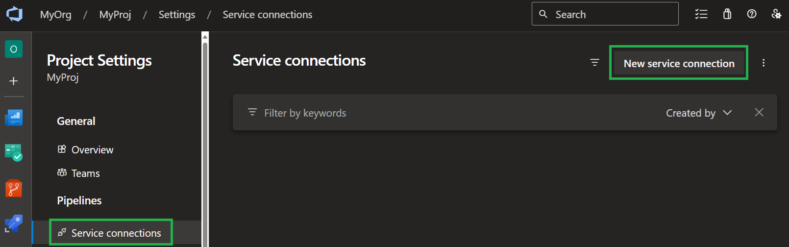
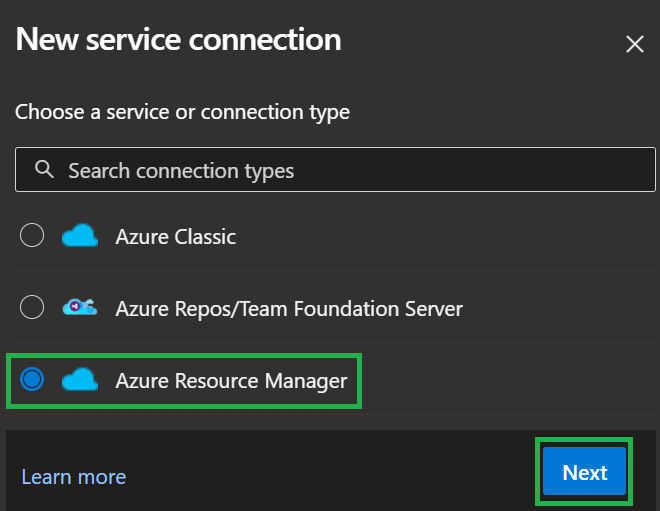
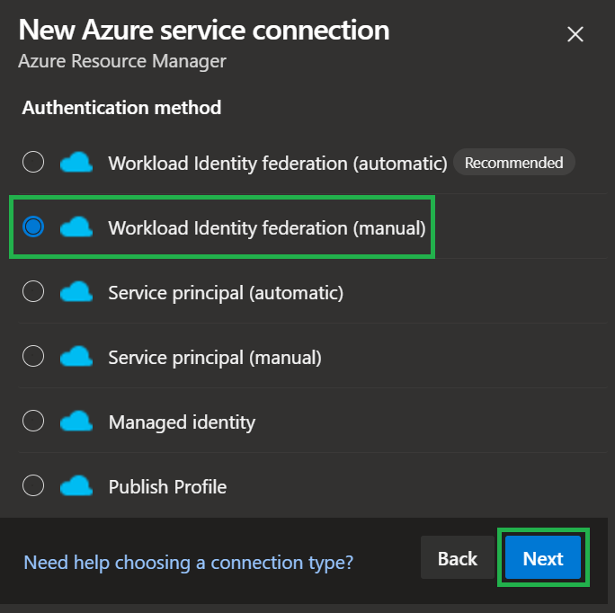
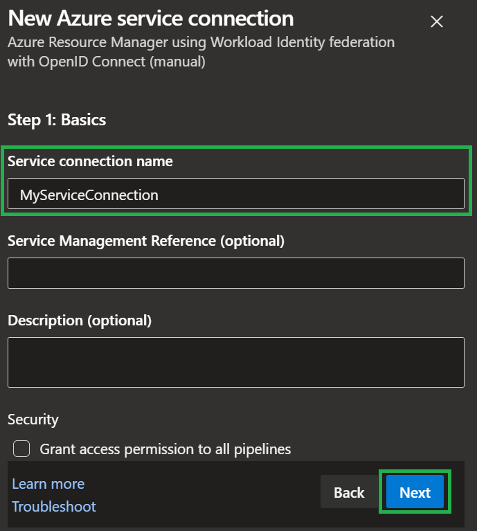
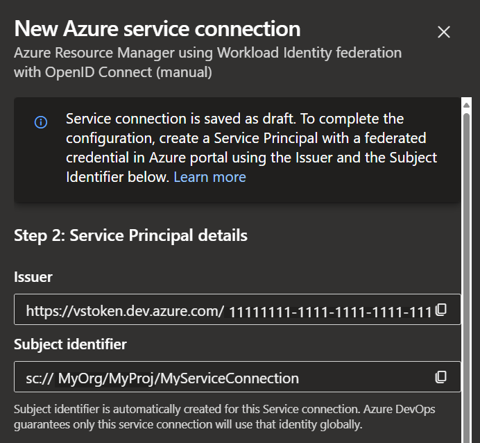
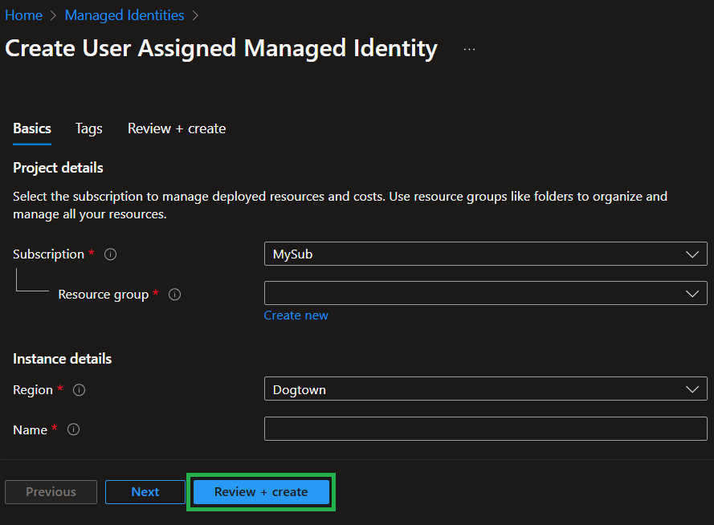
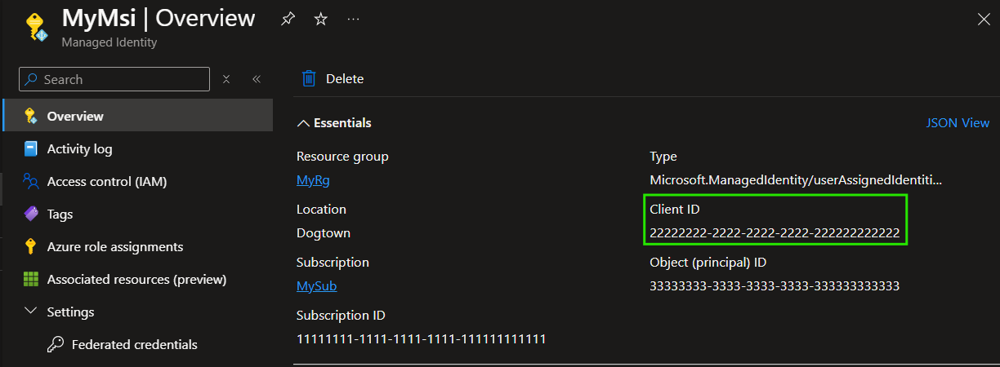
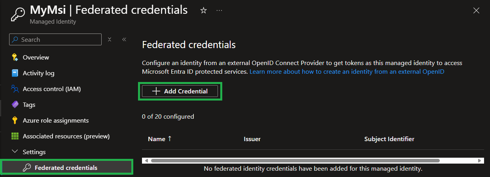
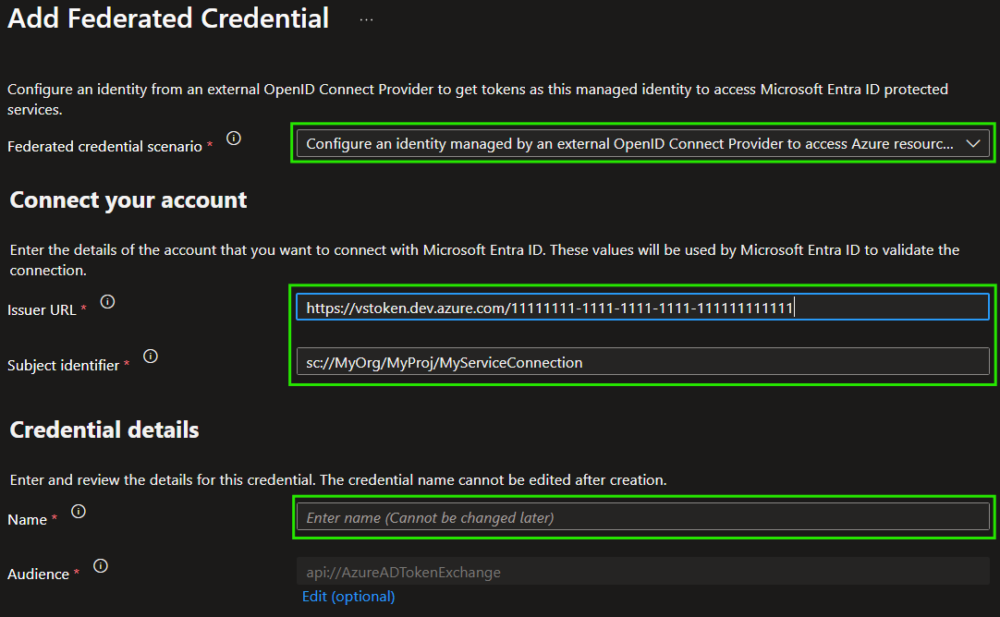
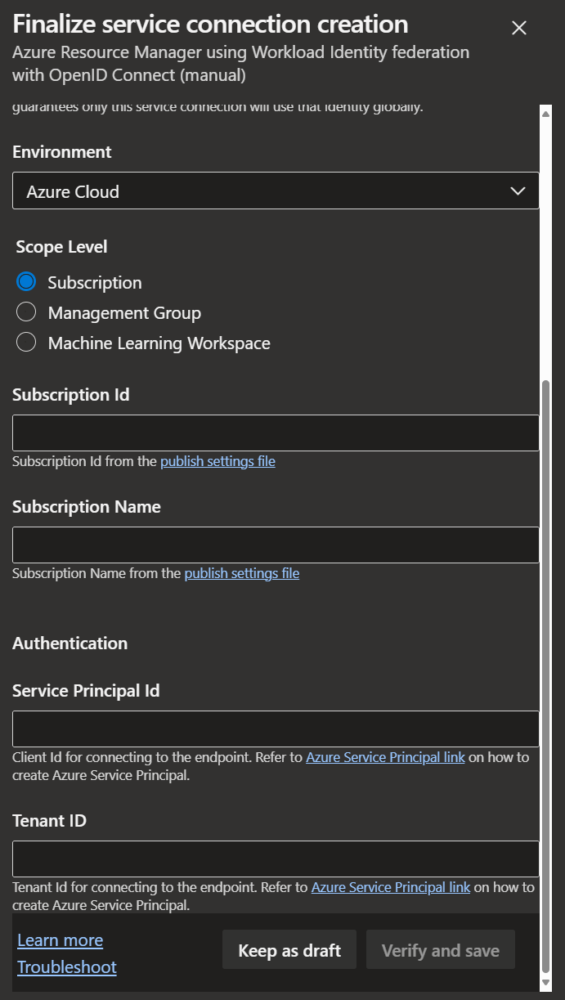

This section gives you an overview of how to set up a managed identity and use it for an OIDC-based service connection in Azure DevOPs

### _Navigation_
- [Create Service Connection (Part 1)](#create-service-connection-part-1)
- [Create managed identity](#create-managed-identity)
- [Create federated credential](#create-federated-credential)
- [Create Service Connection (Part 2)](#create-service-connection-part-2)

# Create Service Connection (Part 1)

1. To start the setup, navigate to the 'Service connections' of your 'Project Settings' and select 'New service connection'

   

1. Next, select 'Azure Resource Manager' as the service connection type and click on 'Next'

   

1. When asked which type of authentication you'd like to use, select 'Workload Identity Federation (manual)'

   

1. Finally, give the to-be service connection a name, and select 'Next' one last time (for now)

   

1. In this following view, take not of the 'Issuer' & 'Subject identifier' values. You'll need those to create the federated credential

   

# Create managed identity

With the service connection prepared, we can now move on the the Managed Identity in Azure

1. To start, navigate to the Managed Identity overview and select '+ Create'

   

1. Next, provide the required information like the resource group, name & location and initialize the creation by selecting the 'Review + create', followed by another click on the 'Create' button

   

1. Once the resource is created, navigate to it so that we can start creating the federated credential. Also, take note of the 'Client ID' in the resource's overview which we will need again to finish up the Service Connection creation later.

   

# Create federated credential

1. On the managed identity resource, select 'Federated credentials' in the resource blade, followed by '+ Add Credential'

   

1. Now, for the
   - 'Federated credential scenario', select '**Other** Configure an identity managed by an external OpenID Connect Provider to access Azure resources as this application'
   - 'Issuer Url' provide the 'Issuer' value from the last step in the preceding Service Connection creation
   - 'Subject identifier' provide the 'Subject identifier' value from the last step in the preceding Service Connection creation
   - Name, a name of your choice

   

1. Finally, finish the creation of the Federated Credential by selecting 'Add'

# Create Service Connection (Part 2)

Now, with the federated credential ready, we can return to the creation of the Service Connection to wrap it up. To do so,

1. Provide all required details in the Service connection's form, including
   - Subscription ID: Must be the Subscription ID of the Subscription containing the created Managed Identity
   - Subscription Name: The name of the Subscription
   - Service Principal Id: The client ID of the created Managed Identity, taken from its overview page. **Note:** This refers to the Client ID, not the Object / Principal ID
   - Tenant ID: The ID of the Tenant containing the created Managed Identity

   

1. Finally, select 'Verify and save' and you should be good to go to use the Service Connection in your pipelines.

   > **NOTE:** Don't forget to grant your Managed Identity the permissions it needs to perform its tasks (e.g., create resources)
