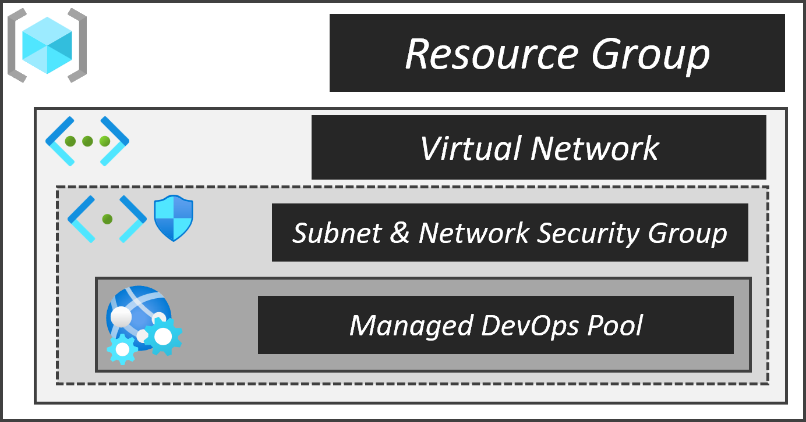
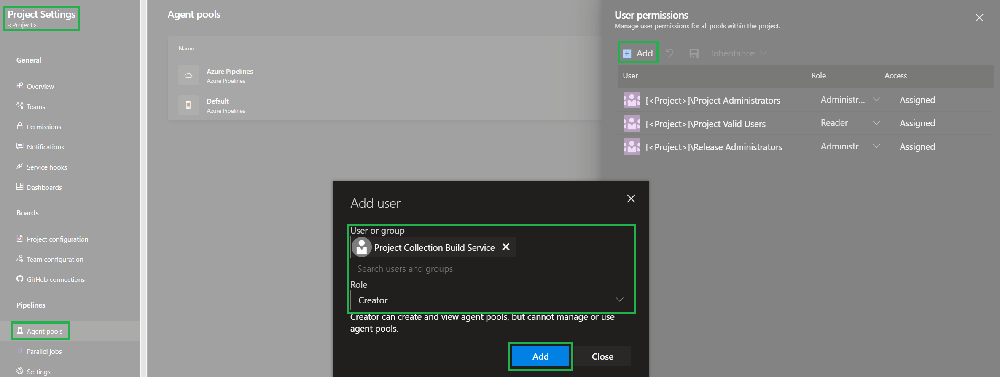
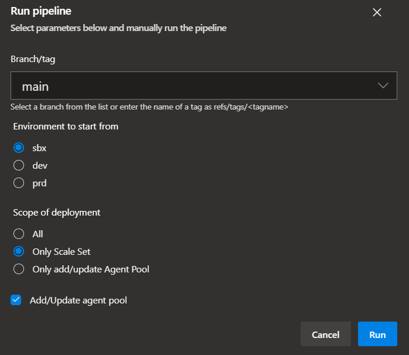

This sections gives you an overview on how to use the Virtual Machine Scale Set pipeline to deploy & maintain self-hosted Azure DevOps Agents using [Virtual Machine Scale Sets](https://docs.microsoft.com/en-us/azure/devops/pipelines/agents/scale-set-agents?view=azure-devops).

### _Navigation_

- [Overview](#overview)
  - [Advantages](#Advantages)
- [Process](#process)
  - [Initial configuration](#initial-configuration)
  - [Deployment](#deployment)
    - [First deployment](#first-deployment)
    - [Consecutive deployments](#consecutive-deployments)
- [Additional considerations](#additional-considerations)
  - [Restricted cross-VNET communication](#restricted-cross-vnet-communication)

# Overview

## Advantages

> Compared to a classic single build host (with multiple agents installed) or a set of permanent deployed containers / virtual machines

- Each pipeline job can use a dedicated new host (if configured accordingly)
- Saving money
  - As the Virtual Machine Scale Set can be configured to e.g. scale in to 0 and spin up a new VM only if a job is scheduled
  - As a single agent is installed on a new instance. Hence virtual machines can be deployed using a SKU with less compute power

## Elements



The scale set agents deployment includes several components:

| &nbsp;&nbsp;&nbsp;                                                                                   | Resource                  | Description                                                                                     |
| ---------------------------------------------------------------------------------------------------- | ------------------------- | ----------------------------------------------------------------------------------------------- |
|                         | Resource Group            | The resource group hosting our Virtual Machine Scale Set resources                              |
|        | Network Security Group    | The network security group linked to the Virtual Machine Scale Set's virtual network subnet     |
|                      | Virtual Network           | The virtual network (and subnet) used by the Virtual Machine Scale Set to deploy instances into |
|  | Virtual Machine Scale Set | The Virtual Machine Scale Set that will host our pipeline agents on its agents                  |

> _**NOTE:**_ The construct was build with multiple environments and staging in mind. To this end, pipeline variable files contain one variable per suggested environment (for example `vmImage_sbx` & `vmImage_dev`) which is automatically referenced by the corresponding stage. For details on how to work with and configure these variables, please refer to this [section](./Staging).
>
> For the rest of the documentation we will ignore these environments and just refer to the simple variable or parameter file to avoid confusion around which file we refer to. All concepts apply to all files, no matter the environment/stage.

# Process

This section explains how to deploy & maintain the scale set construct.

## Initial configuration

Before you start configuring anything you should take note of the following design considerations:

- When deciding for Linux vs. Windows as the instance's underlying OS, note that Linux machines tend to deploy faster than Windows machines and don't required a license
- When registering a ScaleSet for the first time in Azure DevOps, it may take some time for the agents to appear. Azure DevOps first removes the existing instances from the ScaleSet and then deploys new instances with the Azure DevOps agent installed
- When configuring the ScaleSet behavior in Azure DevOps, take into account that it may take a few minutes for new agents to appear when scaling up

To prepare the construct for deployment you have to perform two fundamental steps:

<details>
<summary>1. Configure the deployment parameters</summary>

For this step you have to update these files to your needs:

- `.azuredevops\azureDevOpsScaleSet\variables.yml`
- `constructs\azureDevOpsScaleSet\deploymentFiles\scaleset.bicep`

### Variables

The first file, `variables.yml`, is a pipeline variable file. You should update at least the values:

- `vmImage`: Set this to for example `ubuntu-latest` to leverage Microsoft-hosted agents. Leave it empty (`''`) if you use self-hosted agents. Do not remove it.
- `poolName`: Set this to for example `myHostPool` to leverage your self-hosted agent pool. Leave it empty (`''`) if you use Microsoft-hosted agents. Do not remove it.
- `serviceConnection`: This refers to your Azure DevOps service connection you use for your deployments. It should point into the subscription you want to deploy into.
- `location`: The location to store deployment metadata in. This variable is also used as a default location to deploy into, if no location is provided in the parameter files.

### Parameters

You configure one primary parameter file: `scaleset.bicep`.

The file comes with out-of-the box parameters that you can use aside from a few noteworthy exceptions:

- Update any subscription ID you come across (for example `/subscriptions/11111111-1111-1111-1111-111111111111/`)
- For the image reference you can choose an image from a Shared Image Gallery using both the `virtualMachineScaleSetComputeGalleryName` & `virtualMachineScaleSetComputeGalleryImageDefinitionName` parameters. If you don't define the `virtualMachineScaleSetComputeGalleryImageDefinitionName` parameter with a specific version, it will assume `latest`.
  Example
  ```Bicep
  virtualMachineScaleSetComputeGalleryName: '<YourComputeGallery>'
  virtualMachineScaleSetComputeGalleryImageDefinitionName: 'linux-sid'
  virtualMachineScaleSetImageVersion: '0.24470.675' // (optional)
  ```
- Make sure the scaling is configured as `'manual'` (as Azure DevOps will control the scaling)
- Furthermore, for security reasons, the virtual Machine Scale Set module has [`encryptionAtHost`](https://docs.microsoft.com/en-us/azure/virtual-machines/windows/disks-enable-host-based-encryption-powershell) enabled by default. This feature must be enabled on the subscription prior to the deployment using the command:
  ```powershell
  # Mat take up to 20 minutes to complete
  Register-AzProviderFeature -FeatureName "EncryptionAtHost" -ProviderNamespace "Microsoft.Compute"
  ```
  However, you can also opt-out by explicitly defining the `encryptionAtHost` property with value `false` in the `scaleset.deploy.bicep` template's VMSS deployment.
- Also note, that you will have different parameter sets for the virtual machine scale set parameters, depending on the OS. For example, for windows, the solution currently requires you to provide a value for the `virtualMachineScaleSetAdminPassword` parameter in the parameter file, while for Linux you can use a public key instead

> **Note:** To keep the parameter files as simple as possible, all values that don't necessarily need you attention are hardcoded as default values in the corresponding template files. To get an overview about these 'defaults', you can simply navigate from the parameter file to the linked template.

The parameter file was created with Linux in mind. However, it also contains examples on how the same implementation would look like for Windows. Examples are always commented and can be used to replace the currently not commented values.

As the deployments leverage [`CARML`](https://aka.ms/CARML) modules you can find a full list of all supported parameters per module in that repository's modules. A valid example may be that you want to add specific rules to the network security group deployment. This and several other parameters are available and documented in the module's `readme.md`.

</details>

<p>

<details>

<summary>1.1 (Optional) Configure the agent pool parameters & environment</summary>

Depending on whether you want to register the agent pool automatically (via the pipeline) or manually (via the UI) later in the process, you may also need to configure the parameter file `agentpool.config.json`. When configured, the file is used to automatically register the provisioned virtual machine scale set as an agent pool in an Azure DevOps project. This however requires you to perform two steps:

<details>
<summary>1.1.1 Configure the parameter file</summary>

As the parameter file is not used in a template deployment, it has a slightly different format:

```json
{
   "Project": "<Project>",
   "Organization": "<>",
   "ServiceConnectionName": "<ServiceConnectionName>",
   "AgentPoolProperties": { <AgentPoolPoperties> }
}
```

Use the following table to configure the values according to your requirements:

| Parameter                                   | Default Value | Description                                                                                                                  |
| ------------------------------------------- | ------------- | ---------------------------------------------------------------------------------------------------------------------------- |
| `Project`                                   |               | The name of the Azure DevOps project to register/update the agent pool in                                                    |
| `Organization`                              |               | The name of the Azure DevOps organization that contains the project to register/update the agent pool in                     |
| `ServiceConnectionName`                     |               | The name of the service connection with access to the subscription containing the virtual machine scale set to register with |
| `AgentPoolProperties.ScaleSetPoolName`      |               | The name of the agent pool the register in the Azure DevOps project                                                          |
| `AgentPoolProperties.RecycleAfterEachUse`   | `false`       | Discard node after each job completes                                                                                        |
| `AgentPoolProperties.MaxSavedNodeCount`     | `0`           | Keep nodes in the pool on failure for investigation                                                                          |
| `AgentPoolProperties.MaxCapacity`           | `10`          | Maximum number of nodes that will exist in the elastic pool                                                                  |
| `AgentPoolProperties.DesiredIdle`           | `1`           | Number of agents to have ready waiting for jobs                                                                              |
| `AgentPoolProperties.TimeToLiveMinutes`     | `15`          | The minimum time in minutes to keep idle agents alive                                                                        |
| `AgentPoolProperties.AgentInteractiveUI`    | `false`       | Set whether agents should be configured to run with interactive UI                                                           |
| `AgentPoolProperties.AuthorizeAllPipelines` | `true`        | Setting to determine if all pipelines are authorized to use this agent pool by default. Only considered during creation.     |

</details>

<details>
<summary>1.1.2 Configure the Azure DevOps environment to enable the pipeline to read & register the resources</summary>

Since the pipeline uses the `$(System.AccessToken)` to interact with the environment, and its principal `<Project Name> Build Service (<Organization Name>)` (for example: `My Contoso Project Build (Contoso)`) does not have the required permissions by default, you need to [set two permissions](https://learn.microsoft.com/en-us/azure/devops/pipelines/process/access-tokens?view=azure-devops&tabs=yaml#manage-build-service-account-permissions) in the project's settings to enable the automatic agent pool registration:

> Note: The `<Project Name> Build Service (<Organization Name>)` is created on the organizational level for every new Azure DevOps project. You can find it when you navigate to your 'Organization Settings', Permissions (`'Security'` section), in the `Users` tab.

1.  Enable the build service to list service connections

    1. Navigate to the Azure DevOps's `Project settings`
    1. In the left menu, select `Service connections` of the `Pipelines` section
    1. Then, next to the `New service conncection` button on the top right of the view, select the three `...` and further choose `Security`
    1. Now, select the `+ Add` button on the top of the security menu
    1. Finally, in the opening popup, add the `<Project Name> Build Service (<Organization Name>)` user with role `User` and select `Add`

       

1.  Enable the build service to create agent pools

    1. Navigate to the Azure DevOps's `Project settings`
    1. In the left menu, select `Agent pools` of the `Pipelines` section
    1. Select the `Security` button on the top right
    1. Now, select the `+ Add` button on the top of the security menu
    1. Finally, in the opening popup, add the `<Project Name> Build Service (<Organization Name>)` user with role `Creator` and select `Add`

       

</details>

</details>

<p>

<details>
<summary>2. Register the pipeline</summary>

With the parameters configured, you can now continue and register the pipeline in Azure DevOps.

To do so, you have to perform the following steps:

1. Navigate to the Azure DevOps project you want to register the pipeline in
1. Select `Pipelines` to the left and further its `Pipelines` sub-section

   

1. Further select `New pipeline` on the top right

   

1. Next, select the location of you pipeline file. If you host the repository in GitHub, select `GitHub`, or for example `Azure Repos Git` if you host the code in Azure DevOps's own git.

1. In the opening `Select` step, select your repository

1. In the opening `Configure` step, select `Existing Azure Ppelines YAML`

1. In the opening blade, select the `Branch` your code is in, and in `Path` its path. Once done, select `Continue` on the bottom right

1. In the opening `Review` step, you can now see the pipeline you select and can either select `Run` or (via the dropdown) `Save` on the top right.

1. Optionally, once saved, you can rename & move the pipeline by selecting the three '`...`' on the top right, and select `Rename/move`

   

</details>

## Deployment

The creation of the scale set alongside its resources is handled by the `.azuredevops\azureDevOpsScaleSet\pipeline.yml` pipeline. Given a proper configuration, it creates all required resources in the designated environment. However, if you did not optionally configure the agent-pool parameter file & environment described the [parameters](#parameters) section 'Configure the agent pool parameters & environment', you need to perform an additional manual step afterwards to use the scale set for your agents.

Also, when triggering the pipeline you have several configuration options to chose from:

  

| Runtime Parameter           | Description                                                                                                                                  | On first deployment                          | Additional notes                                                                                                                                                                                                                                                                                                                                                            |
| --------------------------- | -------------------------------------------------------------------------------------------------------------------------------------------- | -------------------------------------------- | --------------------------------------------------------------------------------------------------------------------------------------------------------------------------------------------------------------------------------------------------------------------------------------------------------------------------------------------------------------------------- |
| `Environment to start from` | The environment you want to start to deploy into as described [here](./Staging#3-run-the-pipeline)                                           | Set to `SBX`                                 |                                                                                                                                                                                                                                                                                                                                                                             |
| `Scope of deployment`       | Select whether you want to deploy all resources, only the scale set, or only register the agent pool (if configured)                         | Set to `All`                                 | Overall you have the following options: <p> <li>**`All`**: Deploys all resources end-to-end including the optional agent pool registration (if enabled)</li><li>**`Only Scale Set`**: Deploys only the scale set and optionally registers the agent pool (if enabled)</li><li>**`Only add/update Agent Pool`**: Only executes the agent pool registration (if enabled)</li> |
| `Add/Update agent pool`     | Register or update the agent pool automatically in an Azure DevOps project. Operates independent of the `Scope of the deployment` selection. | Select (if pre-requisites are accounted for) | Requires the corresponding parameter file & environment to be configured correctly as documented in the [parameters](#parameters) section 'Configure the agent pool parameters & environment'.                                                                                                                                                                              |

### First deployment

Upon the first deployment you'll have to perform two steps to get the construct up & running and use it for your pipelines:

<details>
<summary>1. Deploy the Virtual Machine Scale Set</summary>

Navigate to the pipeline described & registered before, set the `Scope of the deployment` to `All` and optionally select the `Add/Update agent pool` checkbox (if configured) upon triggering the pipeline. Once the pipeline concluded, you may continue with the next step.

</details>

<details>
<summary>2. (Optionally) Manually register the Virtual Machine Scale Set in Azure DevOps</summary>

> **Note:** If you have configured the agent pool to be registered automatically and have run the pipeline with the corresponding checkbox (`Add/Update agent pool`) selected, this step can be skipped as the agent pool is already registered.

1. Navigate to the Azure DevOps project,
1. Next, go to `Project Settings` on the bottom left
1. Select `Agent pools` from the settings
1. Select `Add pool` on the top right to initialize the creation of a new agent pool
   - As a `Pool type` select `Virtual Machine Scale Set` and further select the created Virtual Machine Scale Set
   - Give the pool a name
   - You can also configure its scaling behavior, such as
     - The amount of instances at rest (can be 0)
       > We suggest at least `1`
     - The maximum number of instances the scaling can create
       > We suggest at least `10` for regular used environments
     - The time to keep agents up and running before scaling down
       > We suggest at least `15` minutes
     - That each agent is torn down after every use (for that to work make sure the MaxCount is sufficiently high - otherwise it still reuses idle agents) > We suggest `No` if you don't store information that must not be accessible among jobs
       > Once confirmed, an extension is applied by Azure DevOps to the Virtual Machine Scale Set that takes care of registering the agents. Azure DevOps will also take care of the scaling as per the configured values.
1. You can now reference the created pool in your pipelines as per the name you gave the pool in the previous step

</details>

<p>

### Consecutive deployments

You will usually perform idempotent deployments to update a property, or update the image the Scale Set is using.

The image used in the Virtual Machine Scale Set can be idempotently updated. Once a new image is available just restart the ScaleSet deployment pipeline (you can set the `Scope of the deployment` to `Only Scale Set`) and wait for it to complete. New instances will be based on the new image.

> **Note:** Instances that are already deployed are not automatically replaced. For this to happen you may need to trigger an agent refresh on the ScaleSet resource

# Additional considerations

This section suggests you solutions for additional, special designs.

## Restricted cross-VNET communication

If you need to handle resources across non-peered VNETs with firewalls configured, you have to make sure the Virtual Machine Scale Set is able to connect to the resources.
The simplest solution to achieve this is to place the `Virtual Machine Scale Set` in a Subnet of a VNET and assign a [`NAT Gateway`](https://docs.microsoft.com/en-us/azure/virtual-network/nat-gateway/nat-gateway-resource) to it. This [`NAT Gateway`](https://docs.microsoft.com/en-us/azure/virtual-network/nat-gateway/nat-gateway-resource) should have a Public-IP or IP-Prefix assigned.
Once done, communication to

- resources in the same VNET is routed via private IPs and hence require the corresponding Virtual Machine Scale Set subnet to be whitelisted
- resources in any other non-peered VNET are routed via the [`NAT Gateway`](https://docs.microsoft.com/en-us/azure/virtual-network/nat-gateway/nat-gateway-resource)'s public IP (or prefixes) and hence require its IP to be whitelisted

#### [NAT Gateway](https://docs.microsoft.com/en-us/azure/virtual-network/nat-gateway/nat-gateway-resource) Limitations

- NAT is only compatible with standard SKU public IP, public IP prefix, and load balancer resources. Basic resources (for example basic load balancer) and any products derived from them aren't compatible with NAT. Basic resources must be placed on a subnet not configured with NAT
- IPv4 address family is supported. NAT doesn't interact with IPv6 address family. NAT cannot be deployed on a subnet with IPv6 prefix
- NSG flow logging isn't supported when using NAT
- NAT can't span multiple virtual networks
