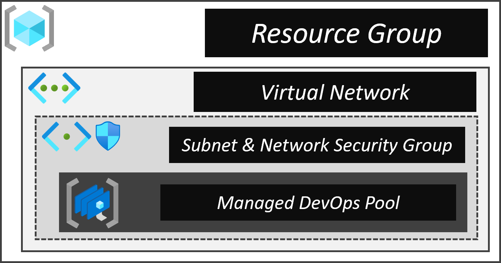
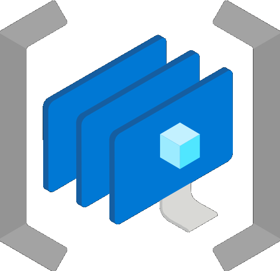
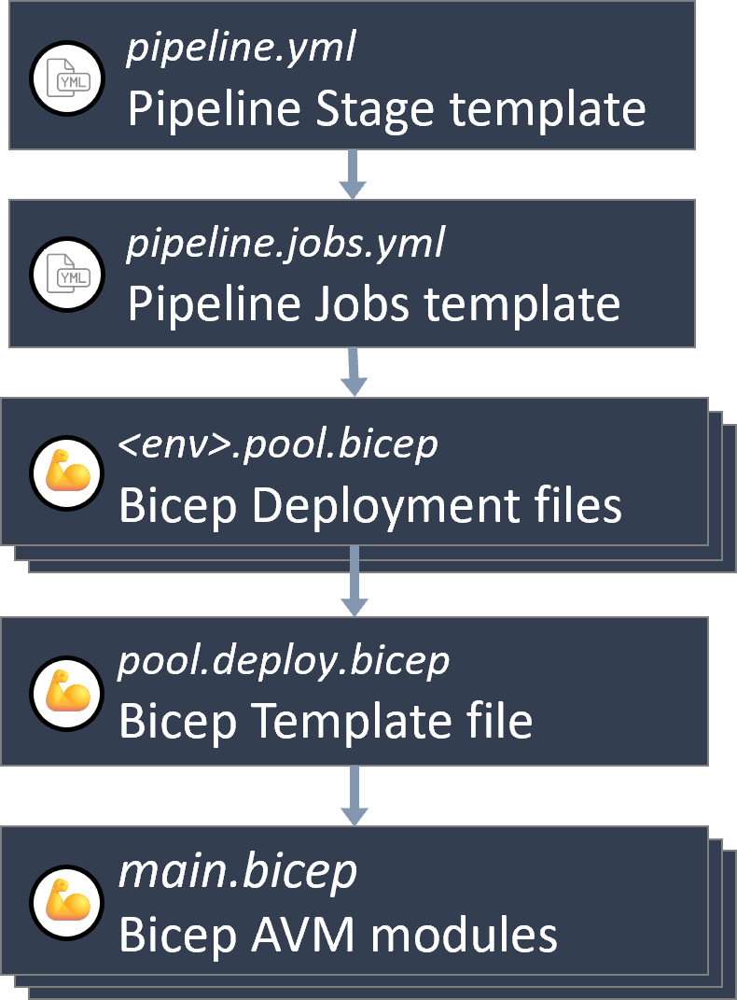
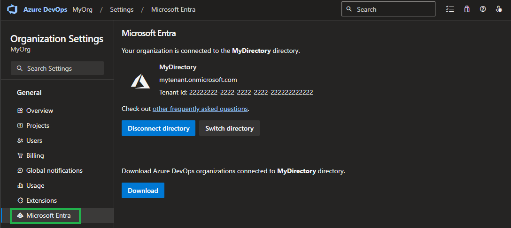
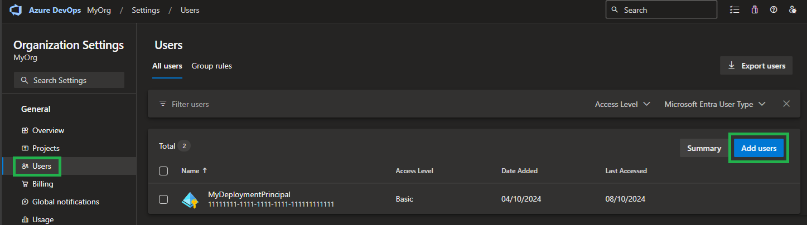
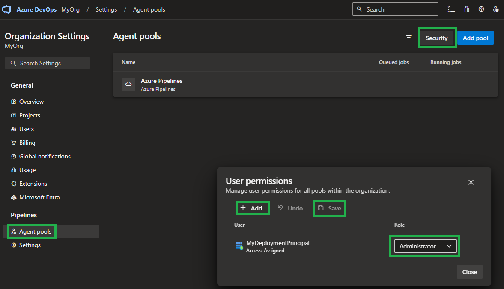
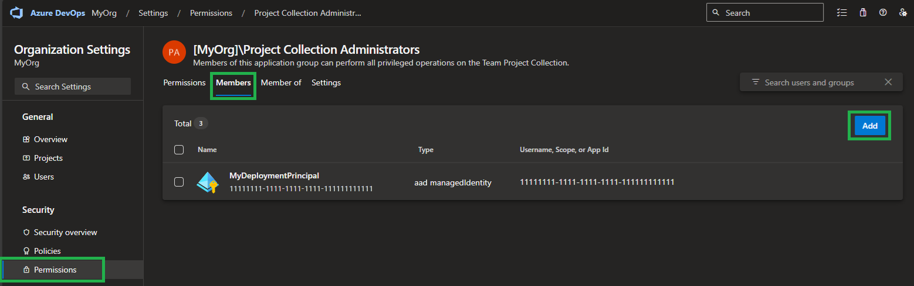
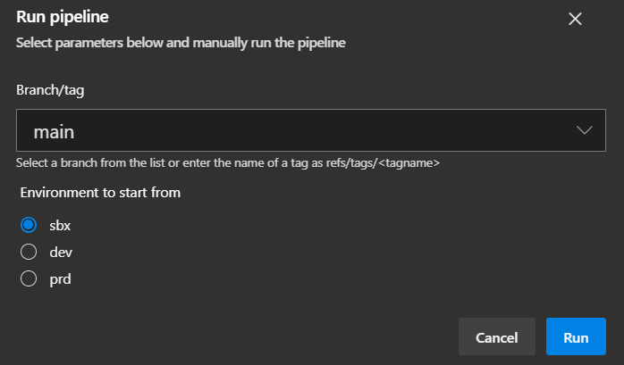

This sections gives you an overview on how to use the Managed DevOps Pool pipeline to deploy & maintain self-hosted Azure DevOps Agents using [Managed DevOps Pools service](https://learn.microsoft.com/en-us/azure/devops/managed-devops-pools/?view=azure-devops).

> **NOTE:** By the time of this release (2024-10-11), the 'Managed Agent Pool' service is still in Public Preview ([ref](https://learn.microsoft.com/en-us/azure/devops/managed-devops-pools/overview?view=azure-devops)). While stable, it is something to consider before deploying the construct.

### _Navigation_

- [Overview](#overview)
  - [Advantages](#Advantages)
  - [Prerequisites](#prerequisites)
  - [Elements](#elements)
  - [File structure & flow](#file-structure--flow)
- [Process](#process)
  - [Initial configuration](#initial-configuration)
  - [Deployment](#deployment)
    - [First deployment](#first-deployment)
    - [Consecutive deployments](#consecutive-deployments)
- [Additional considerations](#additional-considerations)
  - [Restricted cross-VNET communication](#restricted-cross-vnet-communication)

# Overview

## Advantages

> Compared to a classic single build host (with multiple agents installed) or a set of permanent deployed containers / virtual machines

- Each pipeline job can use a dedicated new host (if configured accordingly)
- Saving money
  - As the Managed DevOps Pool can be configured to e.g. scale in to 0 and spin up a new VM only if a job is scheduled
  - As a single agent is installed on a new instance. Hence virtual machines can be deployed using a SKU with less compute power

## Prerequisites

The deployments described in the following sections assume certain prerequisites to be in place prior to deployment.
- The deployment principal (i.e., the principal tied to the deploying Service Connection) **must** be setup for OIDC. This is required so that all AzureCLI tasks that also run _pwsh_ commands can log into the Azure PowerShell context too. For instructions on this matter, please refer to [this guide](./OIDC).

## Elements



The Managed DevOps Pool deployment includes several components:

| &nbsp;&nbsp;&nbsp; | Resource | Description |
| - | - | - |
|  | Resource Group | The resource group hosting our resources |
|  | Network Security Group | The network security group linked to the Managed DevOps Pool's virtual network subnet |
|  | Virtual Network | The virtual network (and subnet) used by the Managed DevOps Pool to deploy instances into |
|  | Managed DevOps Pool | The Managed DevOps Pool that will host our pipeline agents on its agents |

> _**NOTE:**_ The construct was build with multiple environments and staging in mind. To this end, pipeline variable files contain one variable per suggested environment (for example `vmImage_sbx` & `vmImage_dev`) which is automatically referenced by the corresponding stage. For details on how to work with and configure these variables, please refer to this [section](./Staging).
>
> For the rest of the documentation we will ignore these environments and just refer to the simple variable or parameter file to avoid confusion around which file we refer to. All concepts apply to all files, no matter the environment/stage.

## File structure & flow

This section gives you an overview of the solution's structure, that is, how its files are linked to each other.

- **Pipeline Stage template:** This is the entry point for the solution. It's the pipeline template you register in Azure DevOps to trigger a deployment. It contains one stage per environment you'd want to deploy to.
- **Pipeline Jobs template:** This template contains the actual steps of your pipeline, that is tasks that run PowerShell scripts, and or deploy Bicep templates to Azure.
- **Bicep Deployment files:** The Bicep template file that contains the custom parameter you want to set per environment. By default, it only contains a subset of parameters, but can be expanded upon additional parameters available in the _Bicep template file_.
- **Bicep template file:** The Bicep file template file that contains the blueprint / orchestration of the infrastructure you want to deploy into an environment. It has parameters for all relevant infrastructure properties, but can be extended with any additional parameter available in the contained resource (/ module) deployments.
- **Bicep AVM modules:** The resource modules imported from the [Azure Verified Modules](https://aka.ms/avm) library that contain most of the actual resource deployment logic.

<p>



<p>

> **Note:** All files are written in a way that should make modifications easy. However, to help you get started, please take not of the following recommendations:
> - If you want to add additional logic to your pipeline, make sure to modify the `pipeline.jobs.yml` template to ensure that the added / modified steps are applied equally across all stages.
> - If you want to add additional resources to your deployment, make sure to modify the `image.deploy.bicep` file to ensure that the added / modified resources are applied to all environments equally. If you further want to ensure your template remains flexible, you can add additional parameters you can then reference from the `<env>.image.bicep` file.
> - If you want to modify any of the existing module templates and discover a property you want to use is missing, you can simply add it to the corresponding module. However, to use it, make sure to not only add a parameter for your new property to the module, but also give it a value by providing it in the `image.deploy.bicep` file.


# Process

This section explains how to deploy & maintain the Managed DevOps Pool construct.

## Initial configuration

Before you start configuring anything you should take note of the following design considerations:

- When deciding for Linux vs. Windows as the instance's underlying OS, note that Linux machines tend to deploy faster than Windows machines and don't required a license
- When altering the pool's configuration, take into account that it may take a few minutes for new agents to appear when scaling up

To prepare the construct for deployment you have to perform two fundamental steps:

<details>
<summary>1. Configure the deployment parameters</summary>

For this step you have to update these files to your needs:

- `.azuredevops\managedDevOpsPool\variables.yml`
- `constructs\managedDevOpsPool\deploymentFiles\pool.bicep`

### Variables

The first file, `variables.yml`, is a pipeline variable file. You should update at least the values:

- `vmImage`: Set this to for example `ubuntu-latest` to leverage Microsoft-hosted agents. Leave it empty (`''`) if you use self-hosted agents. Do not remove it.
- `poolName`: Set this to for example `myHostPool` to leverage your self-hosted agent pool. Leave it empty (`''`) if you use Microsoft-hosted agents. Do not remove it.
- `serviceConnection`: This refers to your Azure DevOps service connection you use for your deployments. It should point into the subscription you want to deploy into.
- `deploymentMetadataLocation`: The location to store deployment metadata in. The location of the resources it specified directly in the deployment/parameter file.

### Parameters

You configure one primary parameter file: `pool.bicep`.

The file comes with out-of-the box parameters that you can use aside from a few noteworthy exceptions:

- Update any subscription ID you come across (for example `/subscriptions/11111111-1111-1111-1111-111111111111/`)
- For the image reference you can choose an image from a Shared Image Gallery using both the `computeGalleryName` & `computeGalleryImageDefinitionName` parameters. If you don't define the `computeGalleryImageDefinitionName` parameter with a specific version, it will assume `latest`.
  Example
  ```Bicep
  computeGalleryName: 'myGallery'
  computeGalleryImageDefinitionName: 'sid-linux'
  imageVersion: '0.24470.675' // (optional)
  ```
- For the Agent Pool, you can configure diverse settings:
  - `organizationName`: The name of the Azure DevOps Organization to register the Agent Pool in
  - `projectNames`: The name(s) of the Azure DevOps Project to register the Agent Pool in
  - `poolName`: The name to use when registering the Agent Pool (will have the same name in Azure)
  - `devOpsInfrastructureEnterpriseApplicationObjectId`: Tenant-specific 'DevOpsInfrastructure' Enterprise Application objectId. Can be fetched by running `(Get-AzAdServicePrincipal -DisplayName 'DevOpsInfrastructure').Id` while logged into the tenant to deploy into.
  - `poolAgentProfile`: By default the template deploys stateless agents without any automated scaling. In other words, each time a pipeline referencing this pool would be triggered, a new agent would be created and torn down after. However, via the `poolAgentProfile` parameter you can set a wide range of settings ([docs](https://learn.microsoft.com/en-us/azure/devops/managed-devops-pools/configure-scaling?view=azure-devops&tabs=arm)). For example, if you want to keep 1 agent on stand-by for every day of the week you can use the following configuration:
     ```bicep
     agentProfile: {
       kind: 'Stateless'
       resourcePredictions: {
         timeZone: 'UTC'
         daysData: [
            {} // Sunday
            {  // Monday
              '09:00:00': 1
              '17:00:00': 0
            }
            { // Tuesday
              '09:00:00': 1
              '17:00:00': 0
            }
            { // Wednesday
              '09:00:00': 1
              '17:00:00': 0
            }
            { // Thursday
              '09:00:00': 1
              '17:00:00': 0
            }
            { // Friday
              '09:00:00': 1
              '17:00:00': 0
            }
            {} // Saturday
         ]
       }
       resourcePredictionsProfile: {
         kind: 'Manual'
       }
     }
     ```

> **Note:** To keep the parameter files as simple as possible, all values that don't necessarily need you attention are hardcoded as default values in the corresponding template files. To get an overview about these 'defaults', you can simply navigate from the parameter file to the linked template.

The parameter file was created with Linux in mind. However, it also contains examples on how the same implementation would look like for Windows. Examples are always commented and can be used to replace the currently not commented values.

As the deployments leverage [`AVM`](https://aka.ms/avm) modules you can find a full list of all supported parameters per module in that [repository's](https://www.github.com/Azure/bicep-registry-modules) modules. A valid example may be that you want to add specific rules to the network security group deployment. This and several other parameters are available and documented in the module's `readme.md`.

</details>

<p>

<details>
<summary>1.1 Configure the Azure DevOps environment to enable the pipeline to read & register the resources</summary>

Since the Managed DevOps Pool resource (`Microsoft.DevOpsInfrastructure/pools`) not only manages the agents but also registers their Agent Pool in the configured Azure DevOps instance, the deploying identity (e.g., Service Principal) must be granted the required permissions. The official documentation of the required steps can be found [here](https://learn.microsoft.com/en-us/azure/devops/managed-devops-pools/prerequisites?view=azure-devops&tabs=azure-portal#configure-your-azure-devops-organization) and they come down to
1. Connecting the Azure DevOps organization with the Tenant containing both the deploying principal, as well as the future Managed DevOps Pool

   

1. Adding the deploying principal as a 'User' to the Azure DevOps Organization (by default with the 'Basic' License)

   

1. Configuring the deploying principal in the Azure DevOps organization's agent pool security settings as an 'Administrator'

   

   > **Note:** Due to an unknown issue on the Provider's side, it can happen that the 'Administrator' permissions are not sufficient. If the case, you have to add the User to the `Project Collection Administrators` group (in the organization settings' 'Permissions' configuration)
   > 

</details>

<p>

<details>
<summary>2. Register the pipeline</summary>

With the parameters configured, you can now continue and register the pipeline in Azure DevOps.

To do so, you have to perform the following steps:

1. Navigate to the Azure DevOps project you want to register the pipeline in
1. Select `Pipelines` to the left and further its `Pipelines` sub-section

   

1. Further select `New pipeline` on the top right

   

1. Next, select the location of you pipeline file. If you host the repository in GitHub, select `GitHub`, or for example `Azure Repos Git` if you host the code in Azure DevOps's own git.

1. In the opening `Select` step, select your repository

1. In the opening `Configure` step, select `Existing Azure Ppelines YAML`

1. In the opening blade, select the `Branch` your code is in, and in `Path` its path. Once done, select `Continue` on the bottom right

1. In the opening `Review` step, you can now see the pipeline you select and can either select `Run` or (via the dropdown) `Save` on the top right.

1. Optionally, once saved, you can rename & move the pipeline by selecting the three '`...`' on the top right, and select `Rename/move`

   

</details>

## Deployment

The creation of the Managed DevOps Pool alongside its resources is handled by the `.azuredevops\managedDevOpsPool\pipeline.yml` pipeline. Given a proper configuration, it creates all required resources in the designated environment, including the agent pool's registration in Azure DevOps.

Also, when triggering the pipeline you have several configuration options to chose from:

  

| Runtime Parameter | Description | On first deployment | Additional notes |
| - | - | - | - |
| `Environment to start from` | The environment you want to start to deploy into as described [here](./Staging#3-run-the-pipeline) | Set to `SBX` | |

### First deployment

For the first deployment you will only have to run a single pipeline to create and register the Managed DevOps Pool, that is the 'Self-Hosted - Agent Pool' pipeline.

<p>

### Consecutive deployments

You will usually perform idempotent deployments to update a property, or update the image the Managed Agent Pool is using.

> **Note:** Instances that are already deployed are not automatically replaced. For this to happen you may need to trigger an agent refresh on the Managed Agent Pool resource

# Additional considerations

This section suggests you solutions for additional, special designs.

## Restricted cross-VNET communication

If you need to handle resources across non-peered VNETs with firewalls configured, you have to make sure the Managed Agent Pool is able to connect to the resources.
The simplest solution to achieve this is to place the Managed Agent Pool in a Subnet of a Virtual Network and assign a [`NAT Gateway`](https://docs.microsoft.com/en-us/azure/virtual-network/nat-gateway/nat-gateway-resource) to it. This [`NAT Gateway`](https://docs.microsoft.com/en-us/azure/virtual-network/nat-gateway/nat-gateway-resource) should have a Public-IP or IP-Prefix assigned.
Once done, communication to

- resources in the same VNET is routed via private IPs and hence require the corresponding Managed Agent Pool Subnet to be whitelisted
- resources in any other non-peered VNET are routed via the [`NAT Gateway`](https://docs.microsoft.com/en-us/azure/virtual-network/nat-gateway/nat-gateway-resource)'s public IP (or prefixes) and hence require its IP to be whitelisted

#### [NAT Gateway](https://docs.microsoft.com/en-us/azure/virtual-network/nat-gateway/nat-gateway-resource) Limitations

- NAT is only compatible with standard SKU public IP, public IP prefix, and load balancer resources. Basic resources (for example basic load balancer) and any products derived from them aren't compatible with NAT. Basic resources must be placed on a subnet not configured with NAT
- IPv4 address family is supported. NAT doesn't interact with IPv6 address family. NAT cannot be deployed on a subnet with IPv6 prefix
- NSG flow logging isn't supported when using NAT
- NAT can't span multiple virtual networks
