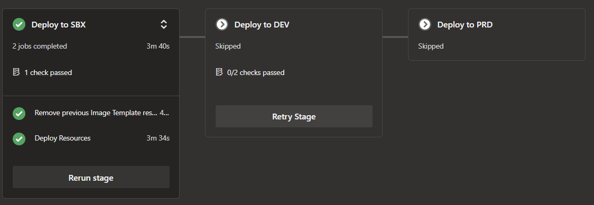
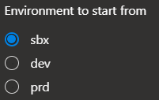

This section gives you an overview of how staging works for the provided constructs, how to work with it, and (if you don't need it) how to remove it.

### _Navigation_
- [How does it work](#how-does-it-work)
- [How to use it](#how-to-use-it)
- [How to optionally remove it](#how-to-optionally-remove-it)

# How does it work

The solution comes with 3 pre-configured stages, SBX, DEV & PRD, and each pipeline deploys sequentially into these environments. However, you can also decide to deploy into an environment directly.



To this end, pipeline variables and parameter files are named as per the environment they belong to:

- Parameters (Bicep) files (in a `parameters` folder): `<env>.<name>.bicep` (for example: `sbx.imageInfra.bicep`)
- Pipeline variables (in a `variables.yml` file): `<name>_<env>` (for example `serviceConnection_sbx`)

Upon triggering a pipeline, the corresponding stage will select the correct parameter file(s) and pipeline variable(s). For an exemplary `SBX` stage this could look like:

```yaml
stages:
- stage: SBX_Deployments
  displayName: Deploy to SBX
  # Comment: Only start if the pipeline runtime parameter 'startEnvironment' was set to sbx
  condition: and(succeeded(), eq('${{ parameters.startEnvironment }}', 'sbx'))
  jobs:
  - template: .templates/pipeline.jobs.yml
    parameters:
      # Comment: Passed to template to set environment & select the correct parameter file (see next example)
      environment: 'sbx'

- stage: DEV_Deployments
  displayName: Deploy to DEV
  # Comment: Only start if the pipeline runtime parameter 'startEnvironment' was set to sbx or dev (=> Continous deployment)
  condition: and(succeeded(), in('${{ parameters.startEnvironment }}', 'sbx', 'dev'))
  jobs:
  - template: .templates/pipeline.jobs.yml
    parameters:
      # Comment: Passed to template to set environment & select the correct parameter file (see next example)
      environment: 'dev'
```
> _**NOTE:**_ The `${{ parameters.<name> }}'` notation corresponds to the pipeline's runtime parameters (on top of the file) and is not to be confused with deployment parameter files (for example `sbx.parameter.bicep`).

In the `pipeline.jobs.yml` file, the values passed in as template parameters (for example `environment: sbx`) could then further be used like:

```yaml
jobs:
- deployment: deploy_job
  displayName: Deploy Resources
  # Comment: Creates an Azure DevOps environment that allows you to set approvers
  environment: ${{ parameters.environment }}
  timeoutInMinutes: 120
  pool:
    # Comment: Leverges the correct self-hosted / ms-hosted agent based on the environment template parameter
    vmImage: '$(vmImage_${{ parameters.environment }})'
    name: '$(poolName_${{ parameters.environment }})'
  strategy:
    runOnce:
      deploy:
        steps:
          - task: AzurePowerShell@4
            displayName: 'Some script'
            inputs:
              # Comment: Reference a variable from the variables.yml file
              azureSubscription: '$(serviceConnection_${{ parameters.environment }})'
              ScriptType: InlineScript
              inline: |
                # Comment: Access the correct parameter file as per the stage's 'environment' template parameter
                templateFilePath = '${{ parameters.environment }}.imageInfra.bicep'
```

# How to use it

With the fundamentals established, let's take a look into how to interact with the stages.

As mentioned previously, the constructs come with differently named parameter files per stage (for example `sbx.bicep`) and variables in the `variable.yml` file (for example `serviceConnection_sbx`).

## 1. Add/Remove environments
The first thing to do when configuring the environment, is to add/remove parameter files or variables as per your requirements (i.e. if you need more or less stages) and also update the `pipeline.yml` file that consumes these (i.e. add / remove stages & optionally also update the pipeline's runtime parameters & conditions).

## 2. Configure environments
Once set, you have to update the values as per your requirements. For example, when selecting a virtual network for a virtual machine scale set, you will most likely use a different one for each environment. Hence navigate to the corresponding parameter files and update each value to match the configuration of this environment.

Example:
- `sbx.bicep`
  ```Bicep
  subnet: {
    id: 'subscriptions/11111111-1111-1111-1111-111111111111/resourceGroups/agents-vmss-rg/providers/Microsoft.Network/virtualNetworks/vmss-vnet-sbx/subnets/vmsssubnet'
  }
  ```
- `dev.bicep`
  ```Bicep
  subnet: {
    id: 'subscriptions/22222222-2222-2222-2222-222222222222/resourceGroups/agents-vmss-rg/providers/Microsoft.Network/virtualNetworks/vmss-vnet-dev/subnets/vmsssubnet'
  }
  ```

The same is true for the pipeline variables. For example, you may use a different service connection for different stages/environments. Hence you have to update the value in the pipeline's `variable.yml` file accordingly.

Example:
```yaml
serviceConnection_sbx: 'sbxConnection'
serviceConnection_dev: 'devConnection'
```

> _**Note:**_ If you use different or additional names than SBX, DEV or PRD, make sure the variable naming schema & parameter file naming schema fit's the new name exactly. (for example if you add a stage `eastus2`, the parameter file would need to be named `eastus2.bicep`, the service connection variable `serviceconnection_eastus2`) and the references in the `pipeline.yml` as well.

## 3. Run the pipeline

Last but not least, if you execute the pipeline, you will notice that runtime parameters such as

```yaml
- name: startEnvironment
  displayName: Environment to start from
  type: string
  default: sbx
  values:
  - sbx
  - dev
  - prd
```

are rendered as



effectively allowing you to choose the environment to start from.

For example, you may want to carry out a 'Continuous Deployment', always starting from sandbox or `sbx` which is selected by default. Once the pipeline is executed and the sandbox stage concluded successfully, the pipeline would automatically continue with the next stage in line (by default, development or `dev`), and so on.

However, you may also opt-in to start the same process directly from the development stage by selecting the corresponding radio button. The pipeline will then directly start from that stage and, like before, continue with is successor (in this case production or `prd`).

# How to optionally remove it

If you have no need for a staging approach, you can also remove any trace of it. For a full cleanup, carry out the following steps:

1. In the `pipeline.yml` file
   - Remove the runtime parameter `startEnvironment` completely
   - Remove any but the first stage and reduce it to
     ```yaml
     - stage: Deployments
       displayName: Deploy
       jobs:
       - template: .templates/<originalTemplateReference>
         parameters:
           <<Keep all template parameters but `environment`>>
     ```

     for example

     ```yaml
     - stage: Deployments
       displayName: Deploy
       jobs:
       - template: .templates/pipeline.scaleset.jobs.yml
         parameters:
           deploymentsToPerform: '${{ parameters.deploymentsToPerform }}'
     ```
1. In any pipeline template file (in the `.templates` folder),
   - remove the `environment` template parameter on the top completely
   - remove any trace of `_${{ parameters.environment }}`
   - replace the `deployment` jobs with simple `jobs`. For example, replace
     ```yaml
     - deployment: deploy_job
       displayName: Deploy Resources
       environment: ${{ parameters.environment }}
       timeoutInMinutes: 120
       pool:
         vmImage: '$(vmImage)'
         name: '$(poolName)'
       strategy:
         runOnce:
           deploy:
             steps:
     ```

     with

     ```yaml
     - job: deploy_job
       displayName: Deploy Resources
       timeoutInMinutes: 120
       pool:
         vmImage: '$(vmImage)'
         name: '$(poolName)'
       steps:
     ```
     > _**NOTE:**_ Make sure to indent the existing steps correctly to the left as YAML detects elements based on their indent

1. In the pipeline's `variable.yml` file, reduce all environment-replicated variables (for example `subscription_sbx` & `subscription_dev`) to a single variable and remove it's environment reference (for example `subscription`)

1. Rename any parameter file from for example `sbx.bicep` to `.bicep`
